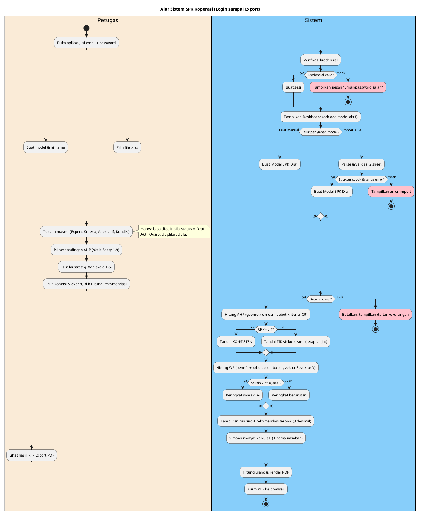

# Diagram BPMN — Alur Sistem SPK Koperasi

Diagram ini adalah versi visual dari `.BPM/alur-sistem-spk-koperasi.md`. Cakupan: satu alur end-to-end dari **login sampai export PDF**.

## Ada TIGA opsi diagram (pilih sesuai kebutuhan)

| Opsi | File | Orientasi | BPMN baku? | Untuk apa |
|------|------|-----------|------------|-----------|
| **BPMN asli (disarankan)** | `spk-koperasi.bpmn` | **Horizontal** | Ya (simbol baku) | Buka & edit di bpmn.io / Camunda / draw.io |
| Versi A — PlantUML | blok di bawah | Vertikal | Tidak (activity diagram) | Render cepat di plantuml.com / VS Code |
| Versi B — mxgraph | blok di bawah | Horizontal | Ya (ikon) | **Hanya** ekstensi Markdown Viewer/docu.md |

---

## Opsi Utama — File `spk-koperasi.bpmn` (BPMN 2.0 Horizontal, Bisa Diedit)

File **`.BPM/spk-koperasi.bpmn`** adalah BPMN 2.0 XML standar dengan tata letak **horizontal** (alur kiri ke kanan) dan simbol BPMN baku (start/end event lingkaran, exclusive gateway diamond, task rounded-rect). Tata letaknya dibuat dengan engine resmi bpmn.io (`bpmn-auto-layout`) dan sudah diverifikasi valid.

**Cara buka & edit:**

1. **bpmn.io** (paling mudah, gratis, online): buka <https://demo.bpmn.io>, klik ikon folder "Open file", pilih `spk-koperasi.bpmn`. Bisa langsung diedit drag-drop dan diekspor ke PNG/SVG.
2. **Camunda Modeler** (aplikasi desktop): File > Open, pilih file tersebut.
3. **draw.io**: Extras > Edit Diagram, atau buka langsung file `.bpmn`.
4. **VS Code**: pasang ekstensi "BPMN Editor (bpmn.io)".

**Catatan jujur soal lane/pool:** engine auto-layout bpmn.io **tidak ikut membuat swimlane berkotak**, jadi file ini berisi alur tanpa lane "tabel". Kalau temanmu mau menambah lane Petugas/Sistem, gampang dilakukan di bpmn.io: pakai tool "Create Pool/Participant" lalu seret elemen ke lane masing-masing. Pembagian tugasnya mengikuti dokumen narasi `alur-sistem-spk-koperasi.md` (Petugas = aksi input/klik; Sistem = verifikasi, parse, hitung, render).

---

## Opsi Cadangan — PlantUML & mxgraph

Dua opsi di bawah ini cepat dipakai bila tidak mau buka tool BPMN.

1. **Versi A — PlantUML standar (activity diagram).** Jalan di **plantuml.com resmi, draw.io (Insert > Advanced > PlantUML), dan ekstensi PlantUML VS Code**. Sudah diuji render. Orientasi vertikal (PlantUML activity tidak bisa horizontal).
2. **Versi B — stensil mxgraph (`mxgraph.bpmn.*`).** Sintaks **khusus ekosistem Markdown Viewer / docu.md**. **TIDAK jalan** di plantuml.com atau draw.io — di sana akan muncul "Syntax Error / Assumed diagram type: class".

---

## Versi A — PlantUML Standar (untuk plantuml.com & draw.io)

Salin seluruh blok di bawah (mulai `@startuml` sampai `@enduml`) ke plantuml.com atau draw.io. Memakai **swimlane** (`|Lane|`) untuk memisahkan Petugas dan Sistem.



> Catatan: gateway **CR <= 0,1** bersifat informatif — kedua cabang tetap lanjut menghitung WP, cabang "tidak" hanya menandai peringatan. Sub-proses lifecycle (Publish/Arsip/Hapus) tidak digambar di sini; lihat Bagian 8 dokumen `alur-sistem-spk-koperasi.md`.

---

## Versi B — Stensil mxgraph (HANYA untuk Markdown Viewer / docu.md)

Konvensi panah: `-->` = alur urutan; `..>` = akses ke Basis Data; label dalam tanda kutip = cabang gateway. **Jangan tempel blok ini ke plantuml.com/draw.io — akan error.**

## Diagram End-to-End

```plantuml
@startuml
left to right direction

rectangle "Petugas" {
  mxgraph.bpmn.event.start "Buka\nAplikasi" as start
  mxgraph.bpmn.user_task "Isi Email &\nPassword" as login_form
  mxgraph.bpmn.user_task "Buat Model\n(Manual)" as buat_model
  mxgraph.bpmn.user_task "Pilih File\nXLSX" as pilih_file
  mxgraph.bpmn.user_task "Isi Data Master\n(Expert/Kriteria/\nAlternatif/Kondisi)" as isi_master
  mxgraph.bpmn.manual_task "Duplikat jadi\nDraf" as dup
  mxgraph.bpmn.user_task "Isi Perbandingan\nAHP" as isi_ahp
  mxgraph.bpmn.user_task "Isi Nilai\nStrategi WP" as isi_wp
  mxgraph.bpmn.user_task "Pilih Kondisi\n& Expert" as pilih_sim
  mxgraph.bpmn.user_task "Klik Hitung\nRekomendasi" as klik_hitung
  mxgraph.bpmn.user_task "Lihat Ranking\n& Detail" as lihat_hasil
  mxgraph.bpmn.user_task "Klik Export\nPDF" as klik_export
}

rectangle "Sistem (Backend)" {
  mxgraph.bpmn.service_task "Verifikasi\nKredensial" as verif
  mxgraph.bpmn.gateway2.exclusive "Kredensial\nvalid?" as gw_login
  mxgraph.bpmn.service_task "Buat Sesi" as buat_sesi
  mxgraph.bpmn.gateway2.exclusive "Ada Model\nAktif?" as gw_aktif
  mxgraph.bpmn.gateway2.exclusive "Jalur\npenyiapan?" as gw_jalur
  mxgraph.bpmn.service_task "Parse &\nValidasi XLSX" as parse
  mxgraph.bpmn.gateway2.exclusive "Struktur\ncocok?" as gw_sheet
  mxgraph.bpmn.gateway2.exclusive "Ada error\nvalidasi?" as gw_err
  mxgraph.bpmn.service_task "Buat Model\nSPK Draf" as buat_draf
  mxgraph.bpmn.gateway2.exclusive "Status =\nDraf?" as gw_draf
  mxgraph.bpmn.service_task "Simpan Data\nMaster" as simpan_master
  mxgraph.bpmn.service_task "Simpan\nPenilaian AHP" as simpan_ahp
  mxgraph.bpmn.service_task "Simpan\nNilai WP" as simpan_wp
  mxgraph.bpmn.gateway2.exclusive "Data cukup\nuntuk dihitung?" as gw_cukup
  mxgraph.bpmn.script_task "Hitung AHP\n(GM, bobot, CR)" as hitung_ahp
  mxgraph.bpmn.gateway2.exclusive "CR <= 0,1?" as gw_cr
  mxgraph.bpmn.script_task "Hitung WP\n(S, V, ranking)" as hitung_wp
  mxgraph.bpmn.gateway2.exclusive "Selisih V\n<= 0,0005?" as gw_tie
  mxgraph.bpmn.service_task "Tampilkan Hasil\n+ Rekomendasi" as tampil
  mxgraph.bpmn.service_task "Render PDF" as render
  mxgraph.bpmn.event.errorEnd "Gagal\nLogin" as end_login_fail
  mxgraph.bpmn.event.errorEnd "Import\nDitolak" as end_import_fail
  mxgraph.bpmn.event.errorEnd "Hitung\nDibatalkan" as end_calc_fail
  mxgraph.bpmn.event.end "Selesai\n(PDF)" as end_ok
}

rectangle "Basis Data" {
  mxgraph.bpmn.data2.dataObject "Akun\nPengguna" as db_user
  mxgraph.bpmn.data2.dataObject "DecisionModel\n(Draf/Aktif/Arsip)" as db_model
  mxgraph.bpmn.data2.dataObject "Data Master +\nPenilaian" as db_data
  mxgraph.bpmn.data2.dataObject "Riwayat Kalkulasi\n(+ nama nasabah)" as db_run
}

start --> login_form
login_form --> verif
verif ..> db_user
verif --> gw_login
gw_login --> end_login_fail : "Tidak"
gw_login --> buat_sesi : "Ya"
buat_sesi --> gw_aktif
gw_aktif --> gw_jalur : "Ya (ringkasan)"
gw_aktif --> gw_jalur : "Belum (ajakan)"

gw_jalur --> buat_model : "Manual"
gw_jalur --> pilih_file : "Import"

buat_model --> buat_draf
pilih_file --> parse
parse --> gw_sheet
gw_sheet --> end_import_fail : "Tidak cocok"
gw_sheet --> gw_err : "Cocok"
gw_err --> end_import_fail : "Ada error"
gw_err --> buat_draf : "Tidak ada"

buat_draf ..> db_model
buat_draf --> isi_master
isi_master --> gw_draf
gw_draf --> dup : "Tidak (Aktif/Arsip)"
dup --> simpan_master
gw_draf --> simpan_master : "Ya"

simpan_master ..> db_data
simpan_master --> isi_ahp
isi_ahp --> simpan_ahp
simpan_ahp ..> db_data
simpan_ahp --> isi_wp
isi_wp --> simpan_wp
simpan_wp ..> db_data
simpan_wp --> pilih_sim

pilih_sim --> klik_hitung
klik_hitung --> gw_cukup
gw_cukup --> end_calc_fail : "Tidak lengkap"
gw_cukup --> hitung_ahp : "Lengkap"
hitung_ahp --> gw_cr
gw_cr --> hitung_wp : "Ya (konsisten)"
gw_cr --> hitung_wp : "Tidak (peringatan)"
hitung_wp --> gw_tie
gw_tie --> tampil : "Ya (peringkat sama)"
gw_tie --> tampil : "Tidak (berurutan)"
tampil ..> db_run
tampil --> lihat_hasil
lihat_hasil --> klik_export
klik_export --> render
render --> end_ok
@enduml
```

---

## Catatan Pola (penjelasan tiap bagian)

1. **Login & Sesi** — `Verifikasi Kredensial` membaca `Akun Pengguna`; gateway `Kredensial valid?` mengarah ke `Gagal Login` atau `Buat Sesi`.
2. **Dashboard** — gateway `Ada Model Aktif?` hanya menentukan tampilan (ringkasan vs ajakan); keduanya tetap lanjut ke pemilihan jalur.
3. **Dua jalur penyiapan model** — gateway `Jalur penyiapan?` bercabang ke **Manual** (`Buat Model`) atau **Import** (`Pilih File XLSX` → `Parse & Validasi`). Jalur import punya dua gerbang: `Struktur cocok?` dan `Ada error validasi?`. Keduanya bermuara ke `Buat Model SPK Draf`.
4. **Guard editable** — gateway `Status = Draf?` mewakili aturan "Model Aktif/Arsip tidak bisa diedit langsung". Cabang "Tidak" memaksa `Duplikat jadi Draf` lebih dulu.
5. **Penilaian** — `Simpan Data Master` → `Simpan AHP` → `Simpan WP`, masing-masing menulis ke `Data Master + Penilaian`.
6. **Perhitungan** — `Data cukup?` adalah gerbang penghenti (bisa membatalkan). `CR <= 0,1?` adalah gerbang **informatif**: kedua cabang tetap lanjut ke WP, cabang "Tidak" hanya menandai peringatan. `Selisih V <= 0,0005?` menentukan peringkat sama (tie) vs berurutan.
7. **Hasil & Riwayat** — `Tampilkan Hasil` menulis `Riwayat Kalkulasi` (termasuk nama nasabah, PII).
8. **Export** — `Klik Export PDF` → `Render PDF` (menghitung ulang dari data terkini) → selesai.

## Tidak digambar di diagram ini (lihat dokumen narasi)

- Sub-proses **lifecycle lengkap**: Publish (Draf → Aktif, dengan validasi kelengkapan; Aktif lama otomatis jadi Arsip), Arsipkan, Pulihkan, Hapus (Aktif tidak boleh dihapus). Ringkasannya ada di Bagian 8 dan Lampiran A dokumen `.BPM/alur-sistem-spk-koperasi.md`.
- **Logout** dan guard sesi pada setiap aksi (di sini hanya digambar sekali di awal).

Untuk memperluas, tambahkan gateway/task baru mengikuti tabel gerbang keputusan di Lampiran A dokumen narasi.
